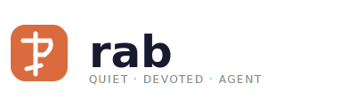

# rab

<p align="center">
  <picture>
    <source media="(prefers-color-scheme: dark)" srcset="assets/logo-dark.svg">
    
  </picture>
</p>

> ⚠️ **Work in Progress** — This project is under active development, but already usable with some caveats. APIs, features, and configuration are subject to change.

**rab** is a lightweight, extensible, Rust-based coding agent.

Inspired by [pi coding agent](https://pi.dev).

rab uses [yoagent](https://crates.io/crates/yoagent) as its core agentic loop and provider framework. Model and provider metadata is fetched from [models.dev](https://models.dev) via the `rab generate-models` command — see [Generating models](#-generating-models) below.

## 📛 Name

**rab** is an archaic Slavic word for *slave* or *servant*, commonly found in the phrase **Раб Божији** (*Rab Božiji*) — *Servant of God*. It shares the same origin with a **robot**, carrying the same notion of a servant who performs work on behalf of another — a fitting name for an agent broker that orchestrates tireless AI agents. Some call coding agents *clankers* — a term that evokes clumsy, rattling machinery. *rab* is the opposite: a quiet, devoted servant, faithful rather than noisy.

## ⚡ Quick Start

### Install via cargo

**Prerequisites:** [Rust](https://rustup.rs/) (latest stable toolchain)

#### Option A: Install directly from git (recommended)

```bash
cargo install --git https://github.com/markokocic/rab.git
```

> ⚠️ The project is under active development — the version on crates.io may be outdated.
> Prefer the git install above for the latest changes.

#### Option B: Install from crates.io

```bash
cargo install rab-agent
```

This installs the `rab` binary.

#### Option C: Clone and build locally

```bash
git clone https://github.com/markokocic/rab.git
cd rab
cargo build --release
./target/release/rab
```

Or to install the binary:

```bash
cargo install --path .
rab
```

## 🧩 Generating Models

Model and provider information (base URLs, model costs, capabilities, etc.) is sourced from [models.dev](https://models.dev). To update the local catalog:

```bash
cargo run -- generate-models
```

This fetches provider/model data for GitHub Copilot, OpenCode (Zen), OpenCode Go, and DeepSeek, applies corrections, and writes it to `provider/src/models.json`.

## ⚖️ License

Copyright © 2026-present Marko Kocic <marko@euptera.com>

This project is licensed under the **Eclipse Public License 2.0 (EPL-2.0)** — see the [LICENSE](LICENSE) file for details.
